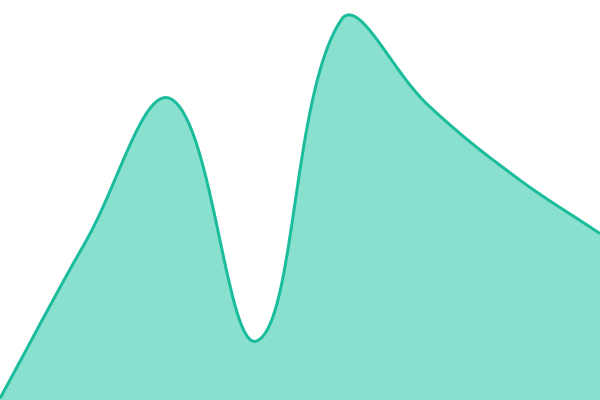

# [📈 Live Status](https://Frost-on-Web.github.io/upptime-web-monitor): <!--live status--> **🟩 All systems operational**

This repository contains the open-source uptime monitor and status page for [Frost](https://Frost-on-Web.github.io/upptime-web-monitor), powered by [Upptime](https://github.com/upptime/upptime).

With [Upptime](https://upptime.js.org), you can get your own unlimited and free uptime monitor and status page, powered entirely by a GitHub repository. We use [Issues](https://github.com/Frost-on-Web/upptime-web-monitor/issues) as incident reports, [Actions](https://github.com/Frost-on-Web/upptime-web-monitor/actions) as uptime monitors, and [Pages](https://Frost-on-Web.github.io/upptime-web-monitor) for the status page.

<!--start: status pages-->
<!-- This summary is generated by Upptime (https://github.com/upptime/upptime) -->
<!-- Do not edit this manually, your changes will be overwritten -->
<!-- prettier-ignore -->
| URL | Status | History | Response Time | Uptime |
| --- | ------ | ------- | ------------- | ------ |
|  [Parc Canadien](https://www.parccanadien.com) | 🟩 Up | [parc-canadien.yml](https://github.com/Frost-on-Web/upptime-web-monitor/commits/HEAD/history/parc-canadien.yml) | 

 936ms
     
 | 

<a href="https://Frost-on-Web.github.io/upptime-web-monitor/history/parc-canadien">100.00%</a>
    

|  [Parc Canadien [Strapi]](https://strapi.parccanadien.com) | 🟩 Up | [parc-canadien-strapi.yml](https://github.com/Frost-on-Web/upptime-web-monitor/commits/HEAD/history/parc-canadien-strapi.yml) | 

 875ms
     
 | 

<a href="https://Frost-on-Web.github.io/upptime-web-monitor/history/parc-canadien-strapi">100.00%</a>
    

|  [Parc Canadien [Shop]](https://shop.parccanadien.com) | 🟩 Up | [parc-canadien-shop.yml](https://github.com/Frost-on-Web/upptime-web-monitor/commits/HEAD/history/parc-canadien-shop.yml) | 

 584ms
     
 | 

<a href="https://Frost-on-Web.github.io/upptime-web-monitor/history/parc-canadien-shop">100.00%</a>
    

|  [Parc Canadien [Admin]](https://admin.parccanadien.com/api/echo) | 🟩 Up | [parc-canadien-admin.yml](https://github.com/Frost-on-Web/upptime-web-monitor/commits/HEAD/history/parc-canadien-admin.yml) | 

 456ms
     
 | 

<a href="https://Frost-on-Web.github.io/upptime-web-monitor/history/parc-canadien-admin">100.00%</a>
    

|  [Parc Canadien [Client]](https://client.parccanadien.com) | 🟩 Up | [parc-canadien-client.yml](https://github.com/Frost-on-Web/upptime-web-monitor/commits/HEAD/history/parc-canadien-client.yml) | 

 555ms
     
 | 

<a href="https://Frost-on-Web.github.io/upptime-web-monitor/history/parc-canadien-client">100.00%</a>
    

|  [Party Backend](https://party-backend.r-mangin.info/health) | 🟩 Up | [party-backend.yml](https://github.com/Frost-on-Web/upptime-web-monitor/commits/HEAD/history/party-backend.yml) | 

 491ms
     
 | 

<a href="https://Frost-on-Web.github.io/upptime-web-monitor/history/party-backend">100.00%</a>
    

|  [Party Frontend](https://free-from-disaster.vercel.app) | 🟩 Up | [party-frontend.yml](https://github.com/Frost-on-Web/upptime-web-monitor/commits/HEAD/history/party-frontend.yml) | 

 120ms
     
 | 

<a href="https://Frost-on-Web.github.io/upptime-web-monitor/history/party-frontend">100.00%</a>
    

<!--end: status pages-->

[**Visit our status website →**](https://Frost-on-Web.github.io/upptime-web-monitor)

## 📄 License

- Powered by: [Upptime](https://github.com/upptime/upptime)
- Code: [MIT](./LICENSE) © [Anand Chowdhary](https://anandchowdhary.com), supported by [Pabio](https://pabio.com)
- Data in the `./history` directory: [Open Database License](https://opendatacommons.org/licenses/odbl/1-0/)
